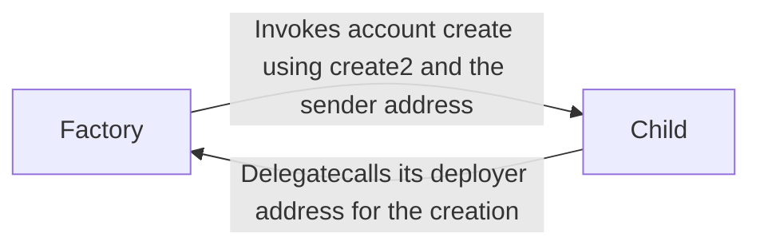

# Superposition Accounts

Superposition Accounts is a ed25519 smart account server that executes calldata on behalf
of the submitter, with a list of goals, permit onramping arguments, and more. The factory
looks up the address of the implementation before executing it. Proxies are configured
using a metamorphic proxy pattern spun up using the storage slot.

Registration is interesting. A user calls the factory contract, which validates the
signature and user data. The factory then uses create2 on the Ethereum address to call the
migration method, which simply delegatecalls back to the factory. The client contract
simply sets some transient storage fields after checking they weren't already set.

## Deployment layout

```dot
Factory -> Client [label="Looks up address"]
AccountServer -> Client [label="Executes the calldata with the goals on this server"]
```

## Onramping (account creation) story



## Dependencies

1. (https://github.com/OffchainLabs/cargo-stylus)[`cargo-stylus-sdk`] -- Cargo Stylus
binary for deployment.

2. (https://github.com/iosiro/arbos-foundry)[`arbos-foundry`] -- Needed for testing.

3. Rust with wasm32-unknown-unknown.

## Deployments

`0xb838e2C1C9e525dFE18D35cd906aEe141ce9CfC2` is the proxy of the accounts factory.
`0x4DeB57eFe97e2bE14772FAfe68773E96c75823EB` is the implementation.

## Building

	make

## Testing

	./tests.sh
