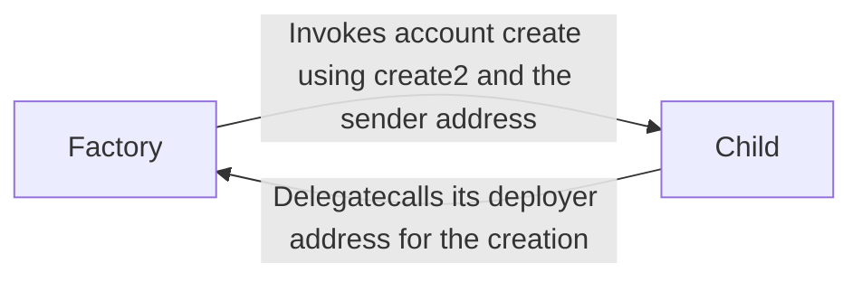

# Superposition Accounts

## Superposition Accounts

Superposition Accounts is a ed25519 smart account server that executes calldata on behalf
of the submitter, with a list of goals, permit onramping arguments, and more. The factory
looks up the address of the implementation before executing it. Proxies are configured
using a metamorphic proxy pattern spun up using the storage slot.

During registration, a user calls the factory contract, which validates the
signature and user data. The factory then uses create2 on the Ethereum address to call the
migration method, which simply delegatecalls back to the factory.

It's possible to register contract "authorities" for accounts registered. These servers
must support the function `allowed(address)(bool)`. These authorities are consulted
before executing a transaction to check if the hash of the contract they're calling is
whitelisted.

Migrations are possible by the EOA owner of the contract.

## Deployment layout

```dot
Factory -> Client [label="Looks up address"]
AccountServer -> Client [label="Executes the calldata with the goals on this server"]
```

## Onramping (account creation) story



## Lite Accounts

A LiteAccount contract is provided that forwards calldata given. The signer should be
cautious as to only sign blobs that are derived from the owner, the operator key, and the
chain id using the factory contract as the base with CREATE2.

## Dependencies

1. (https://github.com/OffchainLabs/cargo-stylus)[`cargo-stylus-sdk`] -- Cargo Stylus
binary for deployment.

2. (https://github.com/iosiro/arbos-foundry)[`arbos-foundry`] -- Needed for testing.

3. Rust with wasm32-unknown-unknown.

## Deployments

### Arbitrum

`0x633da7e11101d8274ef654228eaab944c3f323ca` is the implementation.
`0xEeD043901F4c34147bA8702E739749546b593d6c` is the upgradeable proxy address.
`0x6221a9c005f6e47eb398fd867784cacfdcfff4e7` is the admin address (not an admin contract).
The factory address here is used by the other accounts for the fresh setup.

`0x92e89251b619a5ba2efc0f76efc3051595b489b7` is the enclave implementation, and
`0x58A5f520FF7A6F59863e8a73b066A975799d5d48` is the admin.
`0x27c74C72EdEAA9D17f482B2f1a961b293FdF345D` is the enclave proxy. The enclave public key
is `0xcb47705059ef7fb821fe4ee502682ba6fc94702a722a1f4cabebdc2351fed263` on Arbitrum.

### Superposition

`0xb838e2C1C9e525dFE18D35cd906aEe141ce9CfC2` is the proxy of the main accounts factory.
`0x5c153dcb6cfbd0ffe0f565185a19a1961df0903b` is the implementation.

`0x4B4e7127A5Ae64D7c96997B2c23BdB09C4d47d3F` is the implementation of the 9lives Authority
address. `0x0e3CD9653D9d9610281551d8E3C98035215EA18e` is the proxy.

`0xb23FC1084D686230422e238f97D80c320D7387ee` is the upgradeable factory contract that's
used by the RPC service. `0x7cedA534aE176F1556a4A05fed3847ed2EFF912d` is the admin, and
the public key for the rpc service is
`0xf513398eeedc30f944006f896f157c21f2f6edd050a56cb9d97eb654826a9548`. The implementation
for this contract is `0xcdcef020fd8e000af3e90022df8576b0c060c161`, which is the accounts
service with the SolveV2 and Transfer functions that the main contracts don't support.

## Building

	make

## Testing

Make sure to pull all git submodules:

	git submodule update --init --recursive

Then simply:

	./tests.sh

## Shoutouts

Special shoutout to arbos-foundry and Bernard Wagner for being proactive in resolving
feedback with arbos-foundry.
